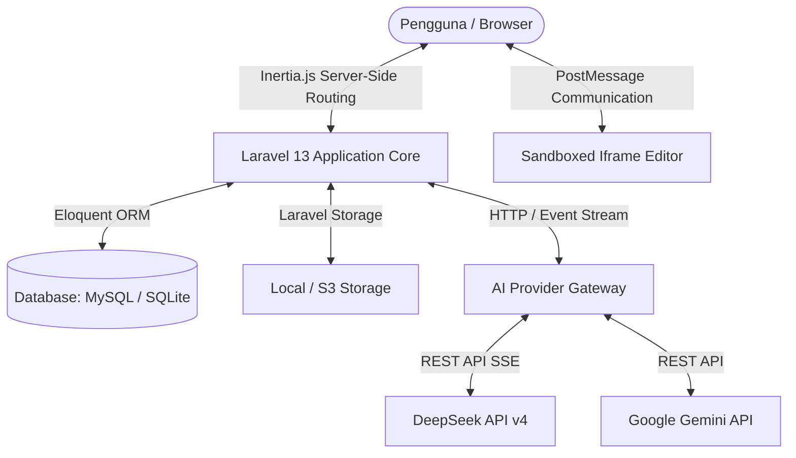
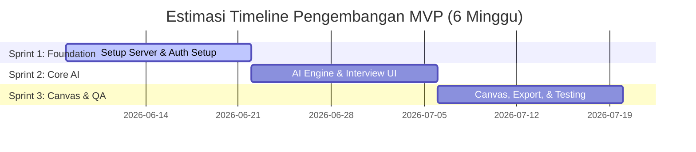

# Product Requirements Document (PRD): AI PRD Generator

## Status Dokumen
- **Versi**: 1.0 (MVP)
- **Status**: [x] Draf Disetujui | [ ] Pengembangan | [ ] Rilis
- **Terakhir Diperbarui**: 2026-06-07

---

## 1. Ringkasan Produk & Masalah Utama

### Ringkasan Produk
**AI PRD Generator** (PRD.ai) adalah aplikasi web berbasis AI yang membantu solo founder, developer, dan product manager mengubah ide produk mentah menjadi Product Requirements Document (PRD) yang terstruktur, rapi, dan siap pakai. Sistem ini bekerja sebagai "Product Manager Virtual" dengan memandu pengguna melalui proses wawancara interaktif (AI Interview) untuk mengurai ide mereka, lalu menyusun dokumen spesifikasi fungsional secara otomatis.

### Masalah Utama yang Dipecahkan
- **Abstraksi Ide**: Pengguna memiliki ide mentah namun kesulitan memecahkannya menjadi komponen-komponen siap bangun.
- **Ketidakpastian MVP**: Kurangnya kemampuan membedakan fitur krusial (Must-Have) dari fitur sekunder (Nice-to-Have).
- **Kesenjangan Komunikasi**: Pengembang seringkali kesulitan memahami kebutuhan produk karena tidak adanya dokumen spesifikasi standar.
- **Pemanfaatan AI Coding**: Pengguna AI coding tools (Cursor, Lovable, v0) memerlukan spesifikasi yang presisi agar AI dapat men-generate kode dengan akurat tanpa banyak revisi.

---

## 2. Target User & Persona

### Target User Utama (Primary)
- **Solo Founder & Indie Hacker**: Memerlukan alat cepat untuk menvalidasi cakupan ide produk sebelum masuk fase pengembangan.
- **Non-Technical Founder**: Membutuhkan panduan terstruktur untuk mendefinisikan kebutuhan teknis aplikasi agar dapat diserahkan ke tim developer/freelancer.
- **Developer Pemula**: Membutuhkan arah pengembangan yang jelas agar proyek tidak meluas tanpa batas (scope creep).

### Target User Sekunder (Secondary)
- **Product Manager & Agency**: Mencari alat bantu otomatisasi untuk mempercepat pembuatan draf PRD pertama.
- **UI/UX Designer**: Membutuhkan ringkasan kebutuhan halaman untuk membuat sketsa wireframe dan alur visual.

---

## 3. Contoh Use Case & User Story

### User Story
1. **Sebagai Non-Technical Founder**, saya ingin memasukkan ide aplikasi mentah dan menjawab pertanyaan klarifikasi AI agar saya bisa mendapatkan PRD yang rapi untuk diserahkan ke developer.
2. **Sebagai Developer Pemula**, saya ingin menyalin kode HTML langsung dari pratinjau desain hasil integrasi PRD agar saya bisa mematangkan tata letak dengan cepat di editor lokal.
3. **Sebagai Product Manager**, saya ingin mengeksport draf PRD dalam format Markdown agar saya bisa membagikannya dan melakukan kolaborasi dengan tim di repositori GitHub kami.

### Skenario Use Case: Alur Pengguna dari Awal hingga Selesai
1. **Masuk Aplikasi & Onboarding**: User mendaftar/masuk dan langsung disuguhkan halaman inisiasi workspace baru.
2. **Input Ide Mentah**: User memilih kategori halaman (misal: "Landing page" atau "Dashboard") dan mengetik deskripsi singkat produk mereka.
3. **AI Interview**: AI menganalisis ide awal dan menanyakan 3-5 pertanyaan klarifikasi secara bertahap (satu per satu) mengenai target pasar, kompetitor, dan fitur unggulan.
4. **Pembuatan PRD**: Setelah user selesai menjawab, AI memproses seluruh input dan menyusun dokumen PRD lengkap dalam format Markdown.
5. **Review & Visualisasi Desain**: User membaca PRD pada editor canvas yang luas. Di samping PRD, user dapat men-toggled pratinjau desain visual (HTML) yang dihasilkan AI.
6. **Ekspor**: User mengklik tombol **"HTML"** atau **"ZIP"** untuk mendownload aset desain dan menyalin kode Markdown PRD.

---

## 4. Prioritas Fitur (P0/P1/P2)

Kami mengelompokkan fitur aplikasi ke dalam matriks prioritas berikut:

| ID | Fitur | Deskripsi | Prioritas | Status |
|:---|:---|:---|:---|:---|
| **F01** | Autentikasi User | Register, login, reset password, 2FA, dan integrasi Passkeys. | **P0** (MVP) | [x] Selesai |
| **F02** | Form Input Ide | Form inisiasi ide produk dengan pilihan jenis halaman (Landing/Dashboard) dan kolom input teks prompt. | **P0** (MVP) | [x] Selesai |
| **F03** | AI Interview | Chat interface interaktif untuk wawancara ide produk (menggunakan model DeepSeek/Gemini). | **P0** (MVP) | [x] Selesai |
| **F04** | PRD Generator | Kompilasi otomatis jawaban wawancara menjadi dokumen Markdown terstruktur. | **P0** (MVP) | [x] Selesai |
| **F05** | Ekspor Markdown | Kemampuan mengunduh berkas mentah `.md`. | **P0** (MVP) | [x] Selesai |
| **F06** | Design Studio Integration | Tombol "Buat design dari PRD" untuk mengonversi spesifikasi menjadi desain visual HTML/CSS interaktif. | **P1** (MVP+) | [x] Selesai |
| **F07** | Live Preview Canvas | Canvas visual yang mendukung visualisasi layout dalam mode desktop, tablet, dan mobile. | **P1** (MVP+) | [x] Selesai |
| **F08** | Code Viewer | Menampilkan kode HTML hasil desain langsung di canvas dengan opsi salin cepat (Copy Code) dan *syntax highlighting*. | **P1** (MVP+) | [x] Selesai |
| **F09** | Rate Limiting AI | Proteksi API request untuk membatasi penyalahgunaan pemanggilan token AI. | **P1** (MVP+) | [ ] Terencana |
| **F10** | Team Sharing & Collaboration| Berbagi link PRD/Mockup kepada pihak eksternal dengan otorisasi read-only. | **P2** (Post-MVP)| [ ] Backlog |
| **F11** | Token Quota Tracking | Sistem kuota bulanan user untuk memonitor konsumsi API dan integrasi dengan sistem pembayaran (Stripe). | **P2** (Post-MVP)| [ ] Backlog |

---

## 5. Wireframe & Deskripsi UI Layout

Aplikasi menggunakan pendekatan tata letak **Split-Pane Workspace** yang responsif untuk memaksimalkan ruang kerja di berbagai ukuran perangkat.

### Layout Halaman Utama (Workspace)
```text
+--------------------------------------------------------------------------------+
|  LOGO | PRD Studio [Preview / Code Toggle]                         User Profile|
+--------------------------------------------------------------------------------+
| HISTORY SIDEBAR     |  PROMPT & INTERVIEW AREA     |  LIVE PREVIEW & CANVAS     |
| - Proyek Coffee     |  [1. Pilih Jenis Halaman]    |                            |
| - Proyek FitApp     |  [2. Input Deskripsi Awal]   |  [View Mode: Preview]      |
|                     |                              |  [Device Frame Selector]   |
| [New Design]        |  [3. AI Interview Chat Box]  |  +----------------------+  |
|                     |    - AI: Siapa target user?  |  | [Sandboxed Iframe]   |  |
|                     |    - User: Solo founder...   |  |                      |  |
|                     |                              |  |                      |  |
|                     |  [Terapkan Revisi] [Reset]   |  +----------------------+  |
|                     |                              |  [View Mode: Code]         |
|                     |  [Proses Build Steps]        |  +----------------------+  |
|                     |    - Menganalisis...         |  | HTML Syntax View     |  |
|                     |    - Menyusun layout...      |  |                      |  |
+---------------------+------------------------------+----------------------------+
```

### Detail Komponen UI & Navigasi
1. **Workspace Header (Sticky)**:
   - **Mode Toggle**: Memungkinkan pengguna berpindah antara mode pratinjau visual (Iframe) dan penampil kode (*Spacious Canvas Code Viewer*).
   - **User Dropdown**: Akses profil, keamanan (2FA/Passkeys), dan setelan penampilan (Dark/Light mode).
2. **History Sidebar (Collapsible)**:
   - Tombol "Design baru" untuk membersihkan canvas dan memulai dari awal.
   - Daftar riwayat desain/PRD sebelumnya yang telah disimpan secara persisten di database.
3. **Prompt & Property Inspector (Left Panel)**:
   - Berfungsi ganda: sebagai panel chat interaktif saat fase perancangan ide, dan berubah menjadi editor properti elemen (visual inspector) ketika pengguna mengaktifkan mode **Edit Visual**.
4. **Canvas Preview & Code (Right Panel)**:
   - Menampilkan pratinjau rendering waktu nyata (*Live Building Preview*) secara bertahap saat AI sedang menulis kode (*streaming HTML*).
   - Menyediakan frame pembatas berukuran presisi untuk simulasi Desktop, Tablet, dan Mobile.
   - Menyediakan tombol ekspor cepat: **HTML** (Download langsung) dan **ZIP** (Kompilasi paket lengkap).

---

## 6. Tech Stack & Arsitektur Sistem

Sistem dikembangkan menggunakan arsitektur monolitik modern dengan pemisahan frontend yang bersih memanfaatkan Inertia.js.

### Detail Tech Stack
- **Frontend Core**: React 19 & TypeScript.
- **Styling**: Tailwind CSS v4 (menyediakan token warna modular dan performa CSS terkompilasi yang tinggi).
- **Backend Framework**: Laravel 13 (PHP 8.5) - menangani routing, database ORM, autentikasi, dan abstraksi API LLM.
- **Frontend-Backend Bridge**: Inertia.js v3 (memungkinkan pengembangan SPA tanpa perlu membangun API terpisah untuk UI internal).
- **Database**: SQLite untuk pengembangan cepat / MySQL untuk lingkungan produksi.
- **Authentication**: Laravel Fortify dengan fitur 2FA terintegrasi dan dukungan Passkeys/WebAuthn.
- **AI Integration**: Integrasi API DeepSeek (model `deepseek-v4-flash` & `deepseek-v4-pro`) dan Gemini (`gemini-3.5-flash` & `gemini-3.1-pro-preview`) melalui gateway `AiProvider` yang diabstraksikan.

### Diagram Arsitektur Tingkat Tinggi (High-Level Architecture)


### API & Authorization Approach
- **Inertia-Driven Routes**: Mayoritas operasi CRUD (menyimpan PRD, memperbarui status, menghapus riwayat) menggunakan route standar Laravel yang merender komponen Inertia.
- **SSE Streaming API**: Untuk pembuatan kode secara real-time, Laravel memancarkan data chunk demi chunk menggunakan HTTP Server-Sent Events (SSE) melalui `DesignStreamController` dan `PrdStreamController`.
- **Laravel Policies**: Otorisasi data diamankan menggunakan model Laravel Policy (`PrdPolicy` dan `DesignPolicy`), yang memastikan bahwa user hanya dapat membaca, memperbarui, atau menghapus data milik mereka sendiri berdasarkan `user_id`.

---

## 7. Estimasi Timeline & Sprint Plan

Pengembangan MVP direncanakan selesai dalam durasi **6 Minggu (3 Sprint)** dengan rincian deliverable sebagai berikut:



### Sprint Milestones
- **Sprint 1 (Minggu 1-2): Foundation & Auth**
  - *Deliverables*: Setup database, sistem registrasi & login user (Fortify + 2FA), dan layout halaman workspace dasar.
- **Sprint 2 (Minggu 3-4): AI Engine & Wawancara Interaktif**
  - *Deliverables*: Hubungan backend ke API DeepSeek/Gemini, modul chat wawancara ide, dan parser parser text jawaban user.
- **Sprint 3 (Minggu 5-6): Canvas Preview, Editor & Ekspor**
  - *Deliverables*: Integrasi pratinjau Iframe, visual inspector editor, canvas penampil kode dengan *syntax highlighting*, fitur unduh HTML/ZIP, rate limiter route AI, dan finalisasi 67 Pest test suites.

---

## 8. Analisis Kompetitor

Kami mengidentifikasi posisi tawar produk di pasar dibandingkan dengan produk alternatif sejenis:

| Aspek | PRD.ai (AI PRD Generator) | ChatGPT / Claude (Generic) | Productboard / Jira (Enterprise) |
|:---|:---|:---|:---|
| **Kemudahan Onboarding** | Sangat Tinggi (dipandu wawancara terstruktur) | Rendah (butuh prompt engineering manual) | Rendah (perlu setup workspace rumit) |
| **Output Teknis** | Markdown PRD & Mockup HTML interaktif | Hanya teks biasa | Dokumen manajemen proyek tanpa kode mockup |
| **Kecepatan Iterasi** | Sangat Cepat (langsung edit visual di canvas) | Sedang (harus kirim prompt koreksi ulang) | Lambat (proses manual oleh PM) |
| **Harga** | Freemium terjangkau untuk solopreneur | Berlangganan API / Bulanan umum | Mahal (biaya lisensi per user/bulan) |

---

## 9. Metrik Kesuksesan & KPI

Untuk mengukur performa produk, kami menetapkan tolok ukur kesuksesan yang realistis pada fase MVP:

- **Tingkat Adopsi (Adoption Rate)**: Minimal **80%** dari pengguna terdaftar membuat setidaknya 1 draf ide produk pada minggu pertama.
- **Tingkat Penyelesaian (Completion Rate)**: Minimal **70%** pengguna yang memulai proses AI Interview berhasil men-generate berkas PRD akhir (tidak berhenti di tengah wawancara).
- **Efisiensi Onboarding (Time-to-Value)**: Pengguna rata-rata dapat menyelesaikan draf PRD pertama mereka dalam waktu **di bawah 8 menit**.
- **Ekspor Dokumen (Export Rate)**: Lebih dari **50%** dari PRD yang selesai di-generate mengalami aktivitas pengunduhan (baik ekspor berkas Markdown maupun ZIP).
- **Metode Pengukuran**: Pemasangan analitik pelacakan alur (*funnel tracking*) menggunakan Mixpanel, pengumpulan skor NPS berkala pasca-generasi, dan pencatatan log penggunaan token AI di database server.

---

## 10. Risiko & Mitigasi

| Risiko | Dampak | Strategi Mitigasi |
|:---|:---|:---|
| **Biaya API LLM Membengkak** | Tinggi (Keuangan) | Menerapkan caching jawaban serupa, membatasi request per menit (*rate limiter* 10 request/menit per user), dan menggunakan model yang lebih cepat & ekonomis (`deepseek-v4-flash`) secara default. |
| **AI Mengalami Timeout (30s limit)** | Sedang (UX Terganggu) | Mengimplementasikan SSE (Server-Sent Events) streaming agar respons AI langsung dikirim secara real-time daripada menunggu selesai. |
| **Output Kode HTML Rusak / Malformed** | Tinggi (UX Canvas) | Membuat skrip validasi HTML di sisi klien dan mengisolasi rendering pratinjau di dalam sandboxed iframe tanpa akses origin silang (`sandbox="allow-scripts"`). |
| **Kebocoran Data Klien** | Tinggi (Keamanan) | Mengisolasi database antarpengguna dengan query filter kepemilikan yang ketat didukung oleh Laravel Policy Authorization. |
